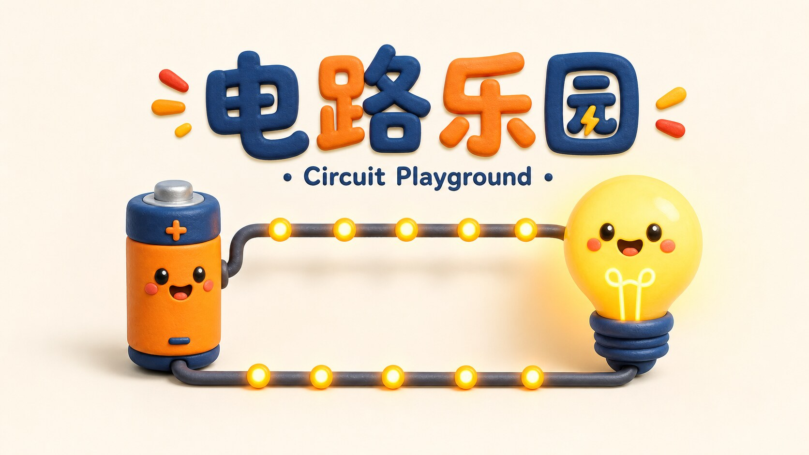
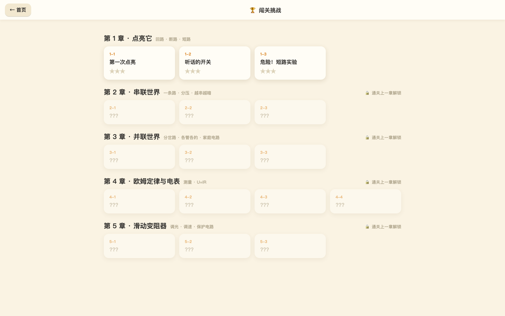
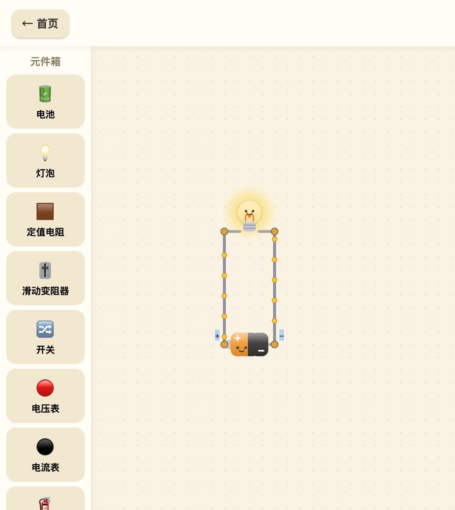
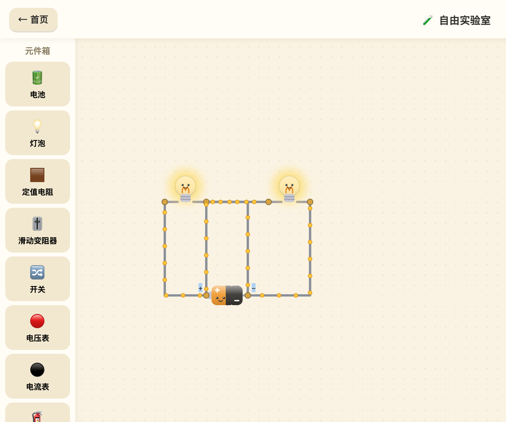
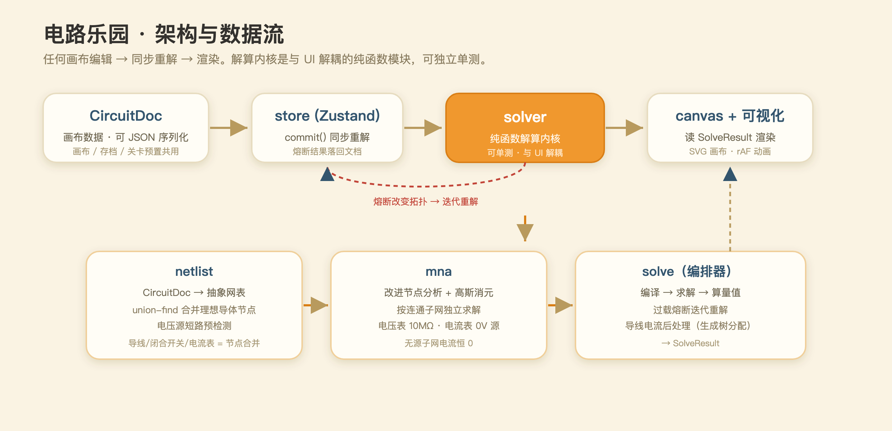

<p align="center">
  
</p>

<h1 align="center">⚡ 电路乐园 · Circuit Playground</h1>

<p align="center">
  给中学生的电学互动游戏 —— 拖元件、连线、<b>实时解算</b>，把看不见的电流和电压变成看得见的光、颜色和流动。
  <br/>
  <i>An interactive DC-circuit playground for middle-schoolers: drag components, wire them up, and watch a real circuit solver light things up in real time.</i>
</p>

<p align="center">
  
  
  
  
  
  
</p>

---

## ✨ 一眼看懂

<table>
  <tr>
    <td width="50%"><p align="center"><sub>首页 · 双模式入口</sub></p></td>
    <td width="50%"><p align="center"><sub>闯关挑战 · 5 章渐进关卡</sub></p></td>
  </tr>
  <tr>
    <td width="50%"><p align="center"><sub>点亮回路 · 电流小点流动、灯泡发光</sub></p></td>
    <td width="50%"><p align="center"><sub>并联双灯 · 解算器处理任意分支</sub></p></td>
  </tr>
</table>

## 背景

孩子在学初中物理电学（串并联、电压、电流、欧姆定律……），但"看不见的电"靠课本和公式很难建立直觉。现有工具里，PhET 是纯沙盒、缺少闯关引导；Falstad circuitjs 面向工程师、对孩子不友好。**电路乐园**想同时做到三件事：

- 🧸 **卡通玩具画风** —— 黏土质感、圆润、部分元件带表情，孩子愿意玩；
- 🎯 **闯关引导** —— 从"点亮第一盏灯"到滑动变阻器调光，一步步建立概念；
- 👁️ **电学量可视化** —— 电流是流动的小点、电压是电势颜色梯度、功率是灯泡亮度，错接会短路发烫、过流会烧断保险丝。

术语与国内初中物理课本（人教版口径）一致。

## 特性

- **通用电路解算器**：自研 MNA（改进节点分析）+ 高斯消元，任意接法都能算——串联、并联、桥式、多回路、短路、断路都不崩。
- **物理正确的反馈**：短路 → 电池发烫警告；过流 → 保险丝熔断并改变拓扑重解；过功率 → 灯泡烧毁；断路 → 无电流。
- **三件套可视化**：电流小点（速度 ∝ 电流）、电势颜色梯度、元件状态（亮度/发热/烧断/电表指针）。
- **双模式**：自由实验室（全元件沙盒）+ 闯关挑战（声明式 JSON 关卡，进度存 localStorage）。
- **零后端、零运行成本**：`npm run build` 产物直接上静态托管（Cloudflare Pages）。

## 技术架构

<p align="center">
  
</p>

解算内核（`src/solver/`）是**与 UI 完全解耦的纯函数模块**，可独立单测、可与手算/Falstad 对拍：

- 理想导线/闭合开关/电流表用 **union-find 节点合并**（而非小电阻近似），避免病态矩阵；
- 电压源被理想导体短接时**预检测**直接判短路，不解方程；
- 电压表建模为 10MΩ 大内阻支路，电流表建模为 0V 电压源；
- 保险丝/灯泡过载 → 熔断 → 改拓扑 → 迭代重解；
- 节点合并丢失的单根导线电流，用簇内生成树流量分配补回，供电流小点动画使用。

技术栈：**Vite + React 19 + TypeScript + Zustand**，画布用 SVG，电流动画走 `requestAnimationFrame` 直改 DOM（不经 React 重渲染，保证 60fps）。更详细的架构与约定见 [`CLAUDE.md`](CLAUDE.md)。

## 快速开始

```bash
npm install
npm run dev      # 开发服务器 (Vite, http://localhost:5173)
npm run build    # tsc -b && vite build → dist/
npm run test     # vitest：解算器单测（改解算逻辑必跑）
npm run lint     # oxlint
```

面向桌面/平板，窄于 768px 会提示"请用平板或电脑"。

## 项目结构

```
src/
  model/          数据模型与元件注册表（九种元件的单一事实源）
  solver/         纯函数解算内核 + 单测（netlist / mna / solve）
  canvas/         SVG 画布、布线、参数面板、元件美术
  visualization/  电流小点、电势颜色、状态叠层
  levels/         声明式关卡数据与谓词判定引擎
  store/          Zustand 全局状态
  app/            页面：Home / Sandbox / LevelSelect / LevelPlay
```

## 📢 关注公众号

本项目由 **Bean Joe（豆子先生）** 一人策划、开发、运营 —— 一只住在 Mac mini 里、专门给孩子当家教的小龙虾 🦞。更多面向中学生的学习资源（语文古诗、化学元素、物理压强、经典常谈……）都在公众号里，欢迎微信扫码关注：

<p align="center">
  
</p>

## 贡献

欢迎 issue / PR。改解算器逻辑请先跑 `npm run test`（对拍值均为手算精确解）；加元件从 `src/model/registry.ts` 起步；加关卡只改 `src/levels/data.ts`。

## License

[MIT](LICENSE) © 2026 Bean Joe（豆子先生）
